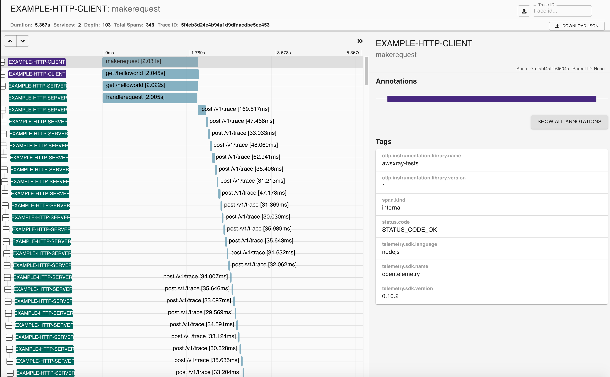
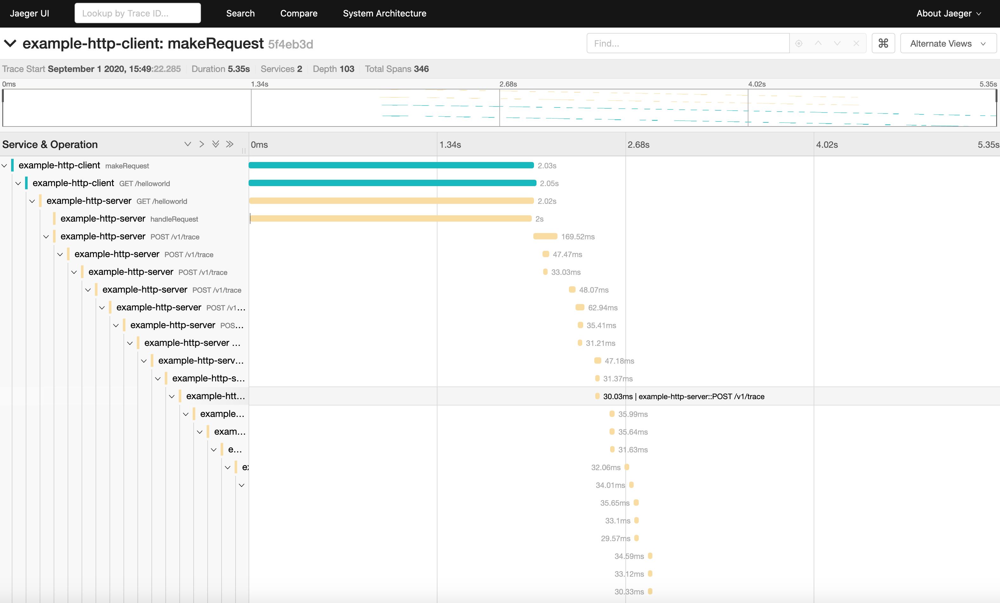
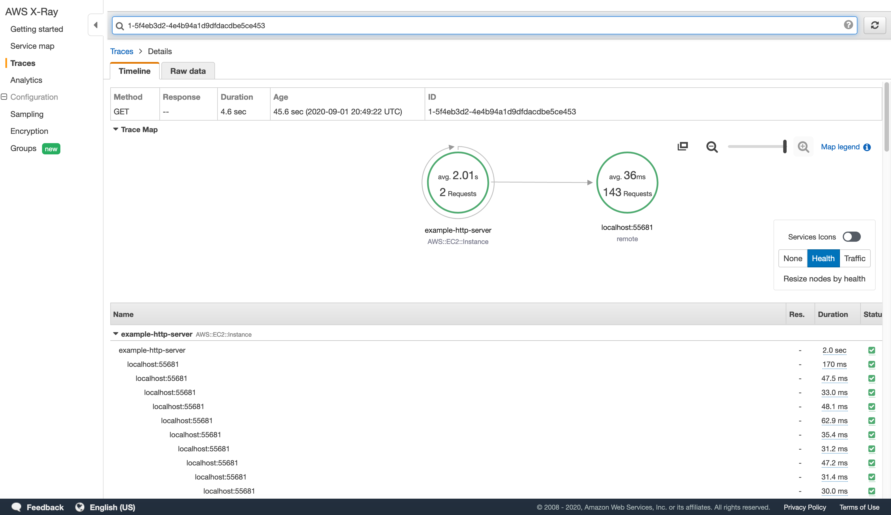

# Example Usage Guide

In our example demo, we mainly have 3 parts of components:

1. **server.js** and **client.js**: These 2 files simulate a sample application and communicate with each other. Note that in JS SDK, the application is using HTTP protocol, and application integrating OpenTelemetry with HTTP by using `@opentelemetry/plugin-http`. (OpenTelemetry JS team is intending to change the naming of all plugins, so the dependency may also change in the future)
2. **tracer.js**: In this file, we instrument OpenTelemetry with AWS X-Ray and finally return a instrumented `Tracer` instance for application to use. The detail of instrumentation we will explain in later section
3. **docker**: In our `docker-compose` file. We mainly take use of follow images:
   * `jaegertracing/all-in-one:latest`: image to simulate Jaeger backend locally
   * `openzipkin/zipkin:latest`: image to simulate Zipkin backend locally
   * `amazon/amazon-ec2-metadata-mock:v1.5.0`: image to simulate EC2 enivironment locally for AWS X-Ray resource detector
   * `otel/opentelemetry-collector-contrib-dev`: image to use OpenTelemetry Collector

For the details of this pipeline and dataflow, you can refer to [here](https://github.com/open-o11y/docs/blob/master/Integrating-OpenTelemetry-JS-SDK-with-AWS-X-Ray/README.md#reference-documents)

# Get Started

In order to get started with this example demo, please follow the steps below:

## Step 1: Configure and run docker

As illustrated before, we have 4 images running in the same time. The first 3 images including Jaeger, Zipkin and EC2 Metadata can work well in any condition. But for Collector, user need to do some configuration jobs.

In `collector-config.yaml`, you may notice that we use 4 exporters to export our tracingd data to different backends:

1. Jaeger Exporter: export to Jaeger backend, corresponding to local `jaegertracing/all-in-one:latest` image
2. Zipkin Exporter: export to Zipkin backend, corresponding to local `openzipkin/zipkin:latest` image
3. Logger Exporter: export the span data to terminal
4. AWS X-Ray Exporter: export to AWS X-Ray backend, **need** further configuration

If you have not configured aws credentials before, you may find this [guide](https://docs.aws.amazon.com/cli/latest/userguide/cli-configure-files.html) useful

If the configuration succeeded, you can run in your terminal:

```
aws configure list
```

And it should print something like:

```
      Name                    Value             Type    Location
      ----                    -----             ----    --------
   profile                <not set>             None    None
access_key     ****************47G3 shared-credentials-file    
secret_key     ****************zDuB shared-credentials-file    
    region                us-east-2      config-file    ~/.aws/config
```

Then under `basic-xray` repo, run this command:

```
npm run docker:start
```

to start the docker, if success, terminal should print:

```
...
jaeger-server_1  | {"level":"info","ts":1598922793.0212545,"caller":"healthcheck/handler.go:128","msg":"Health Check state change","status":"ready"}
...
collector_1      | {"level":"info","ts":1598922793.5785978,"caller":"service/service.go:252","msg":"Everything is ready. Begin running and processing data."}
...
zipkin-server_1  | 2020-09-01 01:13:17.650  INFO 1 --- [           main] z.s.ZipkinServer                         : Started ZipkinServer in 3.51 seconds (JVM running for 4.744)
```

## Step 2: Tackle Dependency Problem

Till the example demo is built, our `AwsXRayPropagator`,  `AwsXRayIdGenerator` and EC2 detectors (for demo purpose) have not been published, so we need to link the local dependency manually.

```
npm link ../../packages/opentelemetry-id-generator-aws-xray
npm link ../../packages/opentelemetry-propagator-aws-xray
npm link ../../packages/opentelemetry-resource-detector-aws-demo
```

There could be some problems related to this step, I will illustrate them and corresponding solution in the troubleshooting section.

## Step 3: Run application

Run following command in different terminal:

```
npm run server
```

and

````
npm run client
````

If everything goes well, in the server terminal, we have:

```
{
  traceId: '5f4eb3d24e4b94a1d9dfdacdbe5ce453',
  parentId: '1a3437130f2a2c2e',
  name: 'POST /v1/trace',
  id: '3aaaaf5c89574d14',
  kind: 2,
  timestamp: 1598993366865133,
  duration: 30885,
  attributes: {
    'http.url': 'http://localhost:55681/v1/trace',
    'http.method': 'POST',
    'http.target': '/v1/trace',
    'net.peer.name': 'localhost',
    'net.peer.ip': '127.0.0.1',
    'net.peer.port': 55681,
    'http.host': 'localhost:55681',
    'http.status_code': 200,
    'http.status_text': 'OK',
    'http.flavor': '1.1',
    'net.transport': 'IP.TCP'
  },
  status: { code: 0 },
  events: []
}
```

And in client terminal:

```
{
  traceId: '5f4eb3d24e4b94a1d9dfdacdbe5ce453',
  parentId: '1a3437130f2a2c2e',
  name: 'POST /v1/trace',
  id: '3aaaaf5c89574d14',
  kind: 2,
  timestamp: 1598993366865133,
  duration: 30885,
  attributes: {
    'http.url': 'http://localhost:55681/v1/trace',
    'http.method': 'POST',
    'http.target': '/v1/trace',
    'net.peer.name': 'localhost',
    'net.peer.ip': '127.0.0.1',
    'net.peer.port': 55681,
    'http.host': 'localhost:55681',
    'http.status_code': 200,
    'http.status_text': 'OK',
    'http.flavor': '1.1',
    'net.transport': 'IP.TCP'
  },
  status: { code: 0 },
  events: []
}
```

## Step 4: Observe the Results

In Zipkin, search for corresponding endpoint using traceId we have, in this example, we use `5f4eb3d24e4b94a1d9dfdacdbe5ce453` (Note to use the generated trace ID by you example demo!!!) and browse http://localhost:9411/zipkin/traces/5f4eb3d24e4b94a1d9dfdacdbe5ce453, It is supposed to show:



In Jaeger, access http://localhost:16686/trace/5f4eb3d24e4b94a1d9dfdacdbe5ce453, it is supposed to show:



Logging into AWS X-Ray console, search for `1-5f4eb3d2-4e4b94a1d9dfdacdbe5ce453` using search bar of X-Ray console



# TroubleShooting

Here I will list several common blockers when using this demo:

### 1. Failed to load AWS_REGION

Sometimes, OpenTelemetry Collector may not work correctly and cannot load the region information which is a **mandatory** part of AWS credentials. This will cause the breakdown of docker Collector. To solve this, you need to set your environment variable value.

Under Unix:

```
export AWS_REGION=us-xxxx-x
```

You can also write this down to your `~/.zrhrc` or `~/bash_profile` to make this more convenient to use

Under Windows OS:

```
set AWS_REGION=us-xxxx-x
```

You can add this environment variable in system setting

### 2. Server side and Client side have different trace ID

It is because Propagator is not instrumented correctly. Till now, the released version of OpenTelemetry JS-SDK is `0.10.2`, in this version, JS SDK cannot instrumented with any custom propagator. This bug has been fixed by [this Pull Request](https://github.com/open-telemetry/opentelemetry-js/pull/1387), but still not released yet.

There are 2 recommended ways to solve this:

1. If the time you use this example demo, there is released JS SDK version newer than `0.10.2`. Then you may try to open the `package.json` of `basic-xray` and `opentelemetry-propagator-aws-xray` repository and change the dependency of `@opentelemetry/context-base` to the latest version. Then do `npm install` in the terminal. It should work

2. If the time when you use this example demo, the released JS SDK version is still `0.10.2`. Then unfortunately, you need to first fork the [upstream](https://github.com/open-telemetry/opentelemetry-js), then

   ```
   git clone git@github.com:USERNAME/opentelemetry-js.git
   
   git remote add upstream https://github.com/open-telemetry/opentelemetry-js.git
   
   #verify that the upstream exists
   git remote -v
   ```

   also make sure you are the updated repository by doing:

   ```
   git fetch upstream
   git checkout master
   git merge upstream/master
   ```

   Then do `npm link` to [this package](https://github.com/open-telemetry/opentelemetry-js/tree/master/packages/opentelemetry-context-base) in the following order:

   1. Do `npm link ../../../opentelemetry-js/packages/opentelemetry-context-base` under `basic-xray` repository
   2. Do `npm link ../../packages/opentelemetry-propagator-aws-xray` still under `basic-xray` repository
   3. Finally do `npm link ../../../opentelemetry-js/packages/opentelemetry-context-base` under `opentelemetry-propagator-aws-xray` repository

   Note that the directory should be consistent with practical use.

   To make the dependency has been updated, go to `node_modules/@opentelemetry`. Run

   ```
   ls -al
   ```

   It is supposed to print:

   ```
   lrwxr-xr-x    1 xxxxxx  ANT\Domain Users     70 Aug 31 18:56 context-base -> ../../../../../../../.npm/lib/node_modules/@opentelemetry/context-base
   ```

### 3. "socket hang up" Problem

After run both client and server, the terminal prints

```
'http.error': 'socket hang up'
```

It is because you are using `0.8.0` version of Collector image. This bug belongs to AWS X-Ray Exporter and has been fixed by us in the latest `0.9.0` version. So do make sure you have pulled the latest image of Collector. This problem can be solved.

### 4. Everything works well, only nothing on AWS X-Ray console

This is because the error message has not been printed out by OpenTelemetry Collector. If you has successfully transmitted your tracing data to AWS X-Ray console, the response message printed by Collector looks like:

```
collector_1      | {"level":"debug","ts":1598993367.705899,"caller":"awsxrayexporter/awsxray.go:94","msg":"response: {\n  UnprocessedTraceSegments: []\n}","component_kind":"exporter","component_type":"awsxray","component_name":"awsxray"}
```

Rather than

```
collector_1      | {"level":"debug","ts":1598993367.705899,"caller":"awsxrayexporter/awsxray.go:94","msg":"response: {\n\n}","component_kind":"exporter","component_type":"awsxray","component_name":"awsxray"}
```

To get more insight into this problem, you can add a debug line to [this line](https://github.com/open-telemetry/opentelemetry-collector-contrib/blob/master/exporter/awsxrayexporter/awsxray.go#L93)

```
logger.Debug('localErr: ' + localErr.Error())
```

Normally, it is because the wrong credentials or access rights of IAM roles.